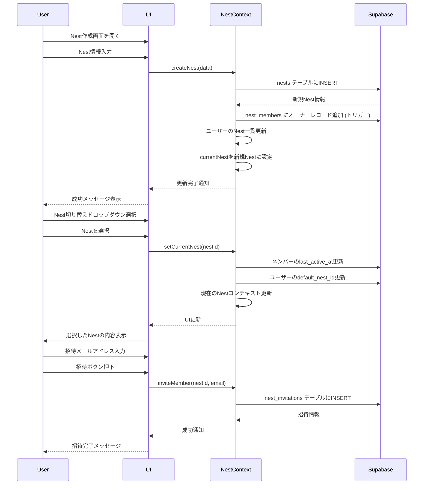

# Nest管理機能の詳細設計

## 1. 概要

Nest（ワークスペース）管理機能は、ユーザーが複数のNestを作成・管理し、それらを切り替えながら利用できる機能です。この設計ドキュメントでは、Nest管理に関連するUI/UXフロー、コンポーネント構造、データフローを詳細に定義します。

## 2. ユーザーストーリー

### 2.1 Nest作成

- ユーザーとして、新しいNestを作成したい
  - Nestの名前と説明を設定できる
  - Nestのアイコンや色を選択できる（オプション）
  - 作成後、自動的に新しいNestがアクティブになる

### 2.2 Nest切り替え

- ユーザーとして、所属している複数のNest間を切り替えたい
  - アプリ内の任意の画面からアクセス可能なUI要素から切り替えられる
  - 最後に使用したNestが次回アプリを開いたときのデフォルトになる

### 2.3 Nestメンバー管理

- Nestオーナーとして、メンバーを招待したい
  - メールアドレスによる招待を送信できる
  - 招待の有効期限を設定できる（オプション）
- ユーザーとして、受け取った招待を承認または拒否したい
- Nestオーナーとして、メンバーの権限を管理したい
- Nestメンバーとして、Nestから退出したい

### 2.4 Nest設定

- Nestオーナーとして、Nestの設定を更新したい
  - 名前、説明、アイコン、色の変更
  - 通知設定の管理
  - プライバシー設定の管理

## 3. UI/UX設計

### 3.1 Nest切り替えUI

Nest切り替えUIは、ヘッダーに配置され、常にアクセス可能な状態にします。

```jsx
const NestSwitcher = () => {
  const { currentNest, userNests, setCurrentNest } = useNest();
  const [isOpen, setIsOpen] = useState(false);

  return (
    <View style={styles.container}>
      <TouchableOpacity 
        style={styles.currentNest} 
        onPress={() => setIsOpen(!isOpen)}
      >
        <Text style={styles.nestName}>{currentNest?.name || 'ホーム'}</Text>
        <Ionicons 
          name={isOpen ? "chevron-up" : "chevron-down"} 
          size={16} 
          color={BrandColors.text.secondary} 
        />
      </TouchableOpacity>

      {isOpen && (
        <View style={styles.dropdown}>
          {userNests.map(nest => (
            <TouchableOpacity 
              key={nest.id} 
              style={[
                styles.nestItem, 
                currentNest?.id === nest.id && styles.activeNestItem
              ]}
              onPress={() => {
                setCurrentNest(nest.id);
                setIsOpen(false);
              }}
            >
              <View style={[
                styles.nestIcon, 
                { backgroundColor: nest.color || BrandColors.primary }
              ]}>
                <Text style={styles.nestInitial}>
                  {nest.name.charAt(0).toUpperCase()}
                </Text>
              </View>
              <Text style={styles.nestItemName}>{nest.name}</Text>
              {nest.is_owner && (
                <View style={styles.ownerBadge}>
                  <Text style={styles.ownerBadgeText}>オーナー</Text>
                </View>
              )}
            </TouchableOpacity>
          ))}
          
          <TouchableOpacity 
            style={styles.createNestButton}
            onPress={() => {
              setIsOpen(false);
              // 新規Nest作成画面へ遷移
              navigation.navigate('CreateNest');
            }}
          >
            <Ionicons name="add-circle-outline" size={20} color={BrandColors.primary} />
            <Text style={styles.createNestText}>新しいNest作成</Text>
          </TouchableOpacity>
        </View>
      )}
    </View>
  );
};

const styles = StyleSheet.create({
  container: {
    position: 'relative',
  },
  currentNest: {
    flexDirection: 'row',
    alignItems: 'center',
    paddingHorizontal: 12,
    paddingVertical: 8,
    borderRadius: 8,
    backgroundColor: BrandColors.backgroundVariants.light,
  },
  nestName: {
    fontSize: 14,
    fontWeight: '600',
    color: BrandColors.text.primary,
    marginRight: 4,
  },
  dropdown: {
    position: 'absolute',
    top: '100%',
    left: 0,
    right: 0,
    backgroundColor: 'white',
    borderRadius: 8,
    marginTop: 4,
    padding: 8,
    shadowColor: '#000',
    shadowOffset: { width: 0, height: 2 },
    shadowOpacity: 0.1,
    shadowRadius: 8,
    elevation: 4,
    zIndex: 10,
  },
  nestItem: {
    flexDirection: 'row',
    alignItems: 'center',
    paddingVertical: 10,
    paddingHorizontal: 12,
    borderRadius: 6,
  },
  activeNestItem: {
    backgroundColor: `${BrandColors.primary}10`,
  },
  nestIcon: {
    width: 28,
    height: 28,
    borderRadius: 14,
    justifyContent: 'center',
    alignItems: 'center',
    marginRight: 8,
  },
  nestInitial: {
    fontSize: 14,
    fontWeight: '600',
    color: 'white',
  },
  nestItemName: {
    fontSize: 14,
    color: BrandColors.text.primary,
    flex: 1,
  },
  ownerBadge: {
    backgroundColor: `${BrandColors.primary}20`,
    paddingHorizontal: 6,
    paddingVertical: 2,
    borderRadius: 4,
  },
  ownerBadgeText: {
    fontSize: 10,
    color: BrandColors.primary,
  },
  createNestButton: {
    flexDirection: 'row',
    alignItems: 'center',
    paddingVertical: 10,
    paddingHorizontal: 12,
    borderTopWidth: 1,
    borderTopColor: `${BrandColors.text.tertiary}20`,
    marginTop: 4,
  },
  createNestText: {
    fontSize: 14,
    color: BrandColors.primary,
    marginLeft: 8,
  },
});
```

### 3.2 新規Nest作成画面

```jsx
const CreateNestScreen = ({ navigation }) => {
  const [name, setName] = useState('');
  const [description, setDescription] = useState('');
  const [color, setColor] = useState(BrandColors.primary);
  const [loading, setLoading] = useState(false);
  const { createNest } = useNest();
  
  const handleCreate = async () => {
    if (!name) {
      Alert.alert('エラー', 'Nestの名前を入力してください');
      return;
    }
    
    setLoading(true);
    const { error, nest } = await createNest({
      name,
      description,
      color,
    });
    setLoading(false);
    
    if (error) {
      Alert.alert('エラー', error.message || 'Nestの作成に失敗しました');
      return;
    }
    
    navigation.goBack();
  };
  
  return (
    <SafeAreaView style={styles.container}>
      <View style={styles.header}>
        <TouchableOpacity 
          style={styles.closeButton}
          onPress={() => navigation.goBack()}
        >
          <Ionicons name="close-outline" size={24} color={BrandColors.text.primary} />
        </TouchableOpacity>
        <Text style={styles.headerTitle}>新しいNest作成</Text>
        <TouchableOpacity 
          style={[styles.createButton, !name && styles.disabledButton]}
          onPress={handleCreate}
          disabled={!name || loading}
        >
          <Text style={styles.createButtonText}>
            {loading ? '作成中...' : '作成'}
          </Text>
        </TouchableOpacity>
      </View>
      
      <ScrollView style={styles.content}>
        <View style={styles.formGroup}>
          <Text style={styles.label}>名前</Text>
          <TextInput
            style={styles.input}
            value={name}
            onChangeText={setName}
            placeholder="Nestの名前を入力"
            maxLength={50}
          />
          <Text style={styles.charCount}>{name.length}/50</Text>
        </View>
        
        <View style={styles.formGroup}>
          <Text style={styles.label}>説明（オプション）</Text>
          <TextInput
            style={[styles.input, styles.textArea]}
            value={description}
            onChangeText={setDescription}
            placeholder="Nestの目的や使い方を説明"
            multiline
            numberOfLines={4}
            maxLength={200}
          />
          <Text style={styles.charCount}>{description.length}/200</Text>
        </View>
        
        <View style={styles.formGroup}>
          <Text style={styles.label}>テーマカラー（オプション）</Text>
          <View style={styles.colorPicker}>
            {nestColors.map(nestColor => (
              <TouchableOpacity
                key={nestColor}
                style={[
                  styles.colorOption,
                  { backgroundColor: nestColor },
                  color === nestColor && styles.selectedColor
                ]}
                onPress={() => setColor(nestColor)}
              />
            ))}
          </View>
        </View>
      </ScrollView>
    </SafeAreaView>
  );
};

const nestColors = [
  BrandColors.primary,
  '#5E97F6', // 青
  '#4CAF50', // 緑
  '#9C27B0', // 紫
  '#FF9800', // オレンジ
  '#795548', // 茶色
  '#607D8B', // 青灰色
  '#F44336', // 赤
];

const styles = StyleSheet.create({
  container: {
    flex: 1,
    backgroundColor: 'white',
  },
  header: {
    flexDirection: 'row',
    alignItems: 'center',
    justifyContent: 'space-between',
    paddingHorizontal: 16,
    paddingVertical: 8,
    borderBottomWidth: 1,
    borderBottomColor: '#eee',
  },
  closeButton: {
    padding: 8,
  },
  headerTitle: {
    fontSize: 16,
    fontWeight: 'bold',
    color: BrandColors.text.primary,
  },
  createButton: {
    paddingHorizontal: 16,
    paddingVertical: 8,
    backgroundColor: BrandColors.primary,
    borderRadius: 8,
  },
  disabledButton: {
    backgroundColor: `${BrandColors.text.tertiary}40`,
  },
  createButtonText: {
    color: 'white',
    fontSize: 14,
    fontWeight: '600',
  },
  content: {
    flex: 1,
    padding: 16,
  },
  formGroup: {
    marginBottom: 24,
  },
  label: {
    fontSize: 14,
    color: BrandColors.text.secondary,
    marginBottom: 8,
  },
  input: {
    backgroundColor: BrandColors.backgroundVariants.light,
    padding: 12,
    borderRadius: 8,
    fontSize: 16,
    color: BrandColors.text.primary,
  },
  textArea: {
    height: 100,
    textAlignVertical: 'top',
  },
  charCount: {
    fontSize: 12,
    color: BrandColors.text.tertiary,
    alignSelf: 'flex-end',
    marginTop: 4,
  },
  colorPicker: {
    flexDirection: 'row',
    flexWrap: 'wrap',
    marginTop: 8,
  },
  colorOption: {
    width: 40,
    height: 40,
    borderRadius: 20,
    margin: 8,
  },
  selectedColor: {
    borderWidth: 3,
    borderColor: 'white',
    shadowColor: '#000',
    shadowOffset: { width: 0, height: 0 },
    shadowOpacity: 0.3,
    shadowRadius: 4,
    elevation: 4,
  },
});
```

### 3.3 Nest設定画面

```jsx
const NestSettingsScreen = ({ navigation }) => {
  const { currentNest, updateNest, nestMembers, inviteMember } = useNest();
  const [name, setName] = useState(currentNest?.name || '');
  const [description, setDescription] = useState(currentNest?.description || '');
  const [inviteEmail, setInviteEmail] = useState('');
  const [loading, setLoading] = useState(false);
  
  const handleSave = async () => {
    if (!name) {
      Alert.alert('エラー', 'Nestの名前を入力してください');
      return;
    }
    
    setLoading(true);
    const { error } = await updateNest(currentNest.id, {
      name,
      description,
    });
    setLoading(false);
    
    if (error) {
      Alert.alert('エラー', error.message || '保存に失敗しました');
      return;
    }
    
    Alert.alert('成功', '設定を保存しました');
  };
  
  const handleInvite = async () => {
    if (!inviteEmail) {
      Alert.alert('エラー', 'メールアドレスを入力してください');
      return;
    }
    
    setLoading(true);
    const { error } = await inviteMember(currentNest.id, inviteEmail);
    setLoading(false);
    
    if (error) {
      Alert.alert('エラー', error.message || '招待に失敗しました');
      return;
    }
    
    Alert.alert('成功', `${inviteEmail}を招待しました`);
    setInviteEmail('');
  };
  
  return (
    <SafeAreaView style={styles.container}>
      <View style={styles.header}>
        <TouchableOpacity 
          style={styles.backButton}
          onPress={() => navigation.goBack()}
        >
          <Ionicons name="arrow-back" size={24} color={BrandColors.text.primary} />
        </TouchableOpacity>
        <Text style={styles.headerTitle}>Nest設定</Text>
        <TouchableOpacity 
          style={styles.saveButton}
          onPress={handleSave}
          disabled={loading}
        >
          <Text style={styles.saveButtonText}>
            {loading ? '保存中...' : '保存'}
          </Text>
        </TouchableOpacity>
      </View>
      
      <ScrollView style={styles.content}>
        <View style={styles.section}>
          <Text style={styles.sectionTitle}>基本情報</Text>
          
          <View style={styles.formGroup}>
            <Text style={styles.label}>名前</Text>
            <TextInput
              style={styles.input}
              value={name}
              onChangeText={setName}
              placeholder="Nestの名前"
            />
          </View>
          
          <View style={styles.formGroup}>
            <Text style={styles.label}>説明</Text>
            <TextInput
              style={[styles.input, styles.textArea]}
              value={description}
              onChangeText={setDescription}
              placeholder="Nestの説明"
              multiline
              numberOfLines={4}
            />
          </View>
        </View>
        
        <View style={styles.section}>
          <Text style={styles.sectionTitle}>メンバー管理</Text>
          
          {nestMembers.map(member => (
            <View key={member.user_id} style={styles.memberItem}>
              <View style={styles.memberInfo}>
                <Text style={styles.memberName}>{member.users.display_name}</Text>
                <Text style={styles.memberEmail}>{member.users.email}</Text>
              </View>
              <View style={styles.memberRole}>
                <Text style={styles.roleText}>
                  {member.role === 'owner' ? 'オーナー' : 'メンバー'}
                </Text>
              </View>
            </View>
          ))}
          
          <View style={styles.inviteContainer}>
            <TextInput
              style={[styles.input, styles.inviteInput]}
              value={inviteEmail}
              onChangeText={setInviteEmail}
              placeholder="メールアドレス"
              keyboardType="email-address"
            />
            <TouchableOpacity 
              style={styles.inviteButton}
              onPress={handleInvite}
              disabled={!inviteEmail || loading}
            >
              <Text style={styles.inviteButtonText}>招待</Text>
            </TouchableOpacity>
          </View>
        </View>
      </ScrollView>
    </SafeAreaView>
  );
};

const styles = StyleSheet.create({
  // 前述のスタイルに追加
  section: {
    marginBottom: 24,
  },
  sectionTitle: {
    fontSize: 18,
    fontWeight: 'bold',
    color: BrandColors.text.primary,
    marginBottom: 16,
  },
  memberItem: {
    flexDirection: 'row',
    justifyContent: 'space-between',
    alignItems: 'center',
    padding: 12,
    backgroundColor: BrandColors.backgroundVariants.light,
    borderRadius: 8,
    marginBottom: 8,
  },
  memberInfo: {
    flex: 1,
  },
  memberName: {
    fontSize: 14,
    fontWeight: '600',
    color: BrandColors.text.primary,
  },
  memberEmail: {
    fontSize: 12,
    color: BrandColors.text.secondary,
  },
  memberRole: {
    backgroundColor: `${BrandColors.primary}15`,
    paddingHorizontal: 8,
    paddingVertical: 4,
    borderRadius: 4,
  },
  roleText: {
    fontSize: 12,
    color: BrandColors.primary,
  },
  inviteContainer: {
    flexDirection: 'row',
    alignItems: 'center',
    marginTop: 16,
  },
  inviteInput: {
    flex: 1,
    marginRight: 8,
  },
  inviteButton: {
    backgroundColor: BrandColors.primary,
    paddingHorizontal: 16,
    paddingVertical: 12,
    borderRadius: 8,
  },
  inviteButtonText: {
    color: 'white',
    fontSize: 14,
    fontWeight: '600',
  },
});
```

### 3.4 招待受け入れフロー

```jsx
const InvitationsScreen = () => {
  const { pendingInvitations, acceptInvitation } = useNest();
  const [loading, setLoading] = useState(false);
  
  const handleAccept = async (token) => {
    setLoading(true);
    const { error } = await acceptInvitation(token);
    setLoading(false);
    
    if (error) {
      Alert.alert('エラー', error.message || '招待の受け入れに失敗しました');
      return;
    }
    
    Alert.alert('成功', 'Nestに参加しました');
  };
  
  if (pendingInvitations.length === 0) {
    return (
      <View style={styles.emptyContainer}>
        <Ionicons name="mail-outline" size={48} color={BrandColors.text.tertiary} />
        <Text style={styles.emptyText}>保留中の招待はありません</Text>
      </View>
    );
  }
  
  return (
    <FlatList
      data={pendingInvitations}
      keyExtractor={item => item.id}
      renderItem={({ item }) => (
        <View style={styles.invitationCard}>
          <View style={styles.invitationHeader}>
            <Text style={styles.nestName}>{item.nests.name}</Text>
            {item.expires_at && (
              <Text style={styles.expiresText}>
                {new Date(item.expires_at).toLocaleDateString()} まで
              </Text>
            )}
          </View>
          
          <Text style={styles.invitationDescription}>
            {item.inviters.display_name} があなたを招待しています
          </Text>
          
          <View style={styles.invitationActions}>
            <TouchableOpacity 
              style={styles.declineButton}
              onPress={() => {/* 拒否処理 */}}
            >
              <Text style={styles.declineButtonText}>拒否</Text>
            </TouchableOpacity>
            
            <TouchableOpacity 
              style={styles.acceptButton}
              onPress={() => handleAccept(item.token)}
              disabled={loading}
            >
              <Text style={styles.acceptButtonText}>
                {loading ? '処理中...' : '参加する'}
              </Text>
            </TouchableOpacity>
          </View>
        </View>
      )}
      contentContainerStyle={styles.listContainer}
    />
  );
};

const styles = StyleSheet.create({
  // スタイル定義
});
```

## 4. データフローダイアグラム



## 5. エラーハンドリング

Nest管理機能における潜在的なエラーケースと対処法：

| エラーケース | 対処法 |
|---|---|
| 同じ名前のNestが既に存在する | ユーザーには一意の名前を要求するエラーメッセージを表示 |
| 招待するメールアドレスが無効 | エラーメッセージを表示し、再入力を促す |
| 招待トークンが無効または期限切れ | 明確なエラーメッセージを表示し、新しい招待を依頼するよう案内 |
| ネットワーク切断中のNest切り替え | ローカルUIは更新するがキャッシュフラグを立て、再接続時に同期 |
| メンバー上限（存在する場合）に達した | 上限に達したことを説明するエラーメッセージを表示 |

## 6. 実装優先度

Nest管理機能の実装は、以下の優先順位で進めることを推奨します：

1. **ベーシックなNest作成と設定**
   - 基本的なNest作成機能
   - Nest情報の編集機能

2. **Nest切り替え機能**
   - Nest切り替えUIコンポーネント
   - 最後に使用したNestの記憶機能

3. **メンバー招待と管理**
   - メール招待機能
   - 招待の承認/拒否処理
   - メンバー一覧表示

4. **高度な機能**
   - テーマカラーなどのカスタマイズオプション
   - 通知設定
   - ロール管理の拡張

## 7. 将来の拡張可能性

- **ロールの細分化**: 現在は「オーナー」と「メンバー」の2ロールだが、将来的には「管理者」などの中間ロールを追加可能
- **招待方法の拡張**: リンク共有による招待機能
- **テンプレートNest**: 特定の目的に適したプリセット構成のNestをテンプレートから作成できる機能
- **アーカイブ機能**: 使用していないNestをアーカイブする機能
- **Nestの統合/分割**: 複数のNestの統合や、大きなNestの分割機能 