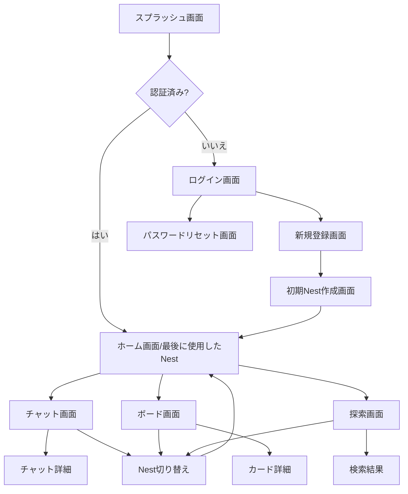
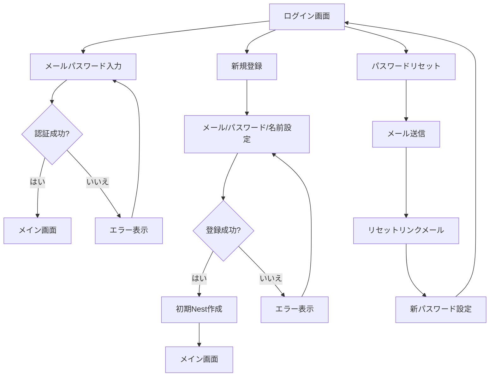
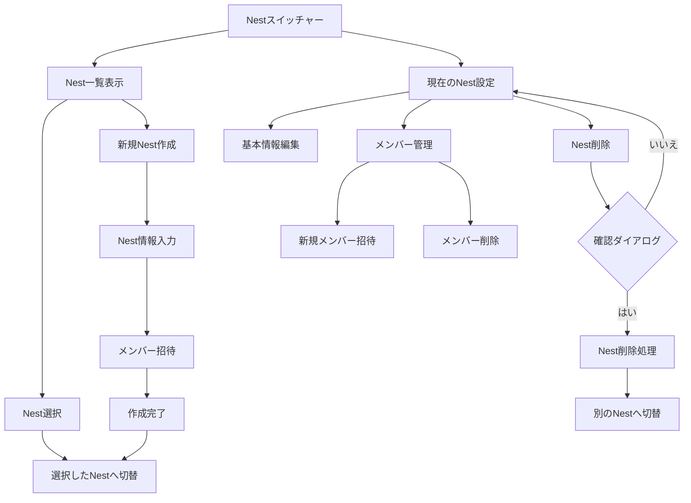

# UI/UXフロー設計

## 1. 概要

このドキュメントでは、PocoNestアプリケーションのUI/UXフローを詳細に設計します。主要な画面遷移、ユーザーインタラクション、マイクロインタラクションについて定義し、一貫性のあるユーザー体験を提供するためのガイドラインを示します。

## 2. 全体アプリフロー

### 2.1 メインフロー

アプリケーションのメインフローは以下の通りです：



### 2.2 認証フロー

ユーザー認証に関するフローを詳細に定義します：



### 2.3 Nest管理フロー

Nest（ワークスペース）の管理に関するフローを詳細に定義します：



## 3. 画面遷移設計

### 3.1 認証画面群

#### ログイン画面


**主要コンポーネント**:
- メールアドレス入力フィールド
- パスワード入力フィールド
- ログインボタン
- アカウント作成リンク
- パスワードリセットリンク

**遷移先**:
- ログイン成功時 → ホーム画面 (または最後に使用したNest)
- アカウント作成リンク → 新規登録画面
- パスワードリセットリンク → パスワードリセット画面

#### 新規登録画面

**主要コンポーネント**:
- メールアドレス入力フィールド
- パスワード入力フィールド
- 表示名入力フィールド
- 登録ボタン
- ログイン画面に戻るリンク

**遷移先**:
- 登録成功時 → 初期Nest作成画面
- ログインリンク → ログイン画面

### 3.2 メインタブ構造

アプリケーションのメインタブ構造は以下の通りです：

```
BottomTabNavigator
├── ホーム（または最後に使用したNest）
├── チャット
├── ボード
└── 探索（検索+遊び）
```

各タブはStackNavigatorを持ち、詳細画面への遷移を管理します：

```
ホームStack
├── ホーム画面
├── お知らせ詳細画面
└── その他情報画面

チャットStack
├── チャット一覧画面
├── チャット詳細画面
└── メディア表示画面

ボードStack
├── ボード画面
├── カード詳細画面
└── カード編集画面

探索Stack
├── 探索メイン画面
├── 検索結果画面
└── 知識マップ画面
```

### 3.3 モーダル構造

モーダルはアプリ全体で一貫したデザインとインタラクションを持ちます：

**カード作成モーダル**:
- タイトル入力
- 内容入力
- タグ設定
- カラム選択
- 作成/キャンセルボタン

**Nest切り替えモーダル**:
- 現在のNest表示
- Nest一覧
- 新規Nest作成ボタン
- 設定ボタン

**招待モーダル**:
- メールアドレス入力
- 招待メッセージ（オプション）
- 送信/キャンセルボタン

## 4. マイクロインタラクション設計

### 4.1 トランジションとアニメーション

| 要素 | アニメーション | 詳細 |
|---|---|---|
| ボタンタップ | バウンス + スケール | わずかに縮小(0.97)→元に戻る、150ms |
| リスト項目スワイプ | スライド + オパシティ | 横方向スライド、オプション表示、200ms |
| タブ切り替え | クロスフェード | 透明度の変化、150ms、イージング |
| モーダル表示 | スライドアップ | 下から上へスライド、250ms、ダンピング |
| カード移動 | ドラッグと着地 | ドラッグ中は軽いスケール(1.02)、着地時にわずかなバウンス |

### 4.2 フィードバック設計

| アクション | フィードバック | 詳細 |
|---|---|---|
| ボタンタップ | 触覚 + 視覚 | 軽い振動(iOS:selection)、色の変化 |
| エラー発生 | 触覚 + 視覚 + 音声 | 強めの振動(iOS:error)、赤色表示、エラー音 |
| Nest切り替え | 触覚 + 視覚 | 中程度の振動、アニメーションで強調 |
| メッセージ送信 | 視覚 | 送信状態の変化を視覚的に表示 |
| ドラッグ完了 | 触覚 + 視覚 | 軽い振動、ハイライト表示で成功を強調 |

### 4.3 空の状態と読み込み状態

| 画面 | 空の状態 | 読み込み状態 |
|---|---|---|
| ボード | ポコのイラスト + 「まだカードがありません」 | スケルトンローディング + 小さなスピナー |
| チャット | ポコのイラスト + 「会話を始めましょう」 | メッセージバブルのスケルトン表示 |
| 検索 | 虫眼鏡アイコン + 「検索してみましょう」 | 検索結果のスケルトンローディング |
| Nest一覧 | ポコのイラスト + 「Nestを作成しましょう」 | Nest項目のスケルトン表示 |

## 5. レスポンシブデザイン

### 5.1 デバイス対応

| デバイス | 対応方針 | 注意点 |
|---|---|---|
| スマートフォン(iPhone) | 主要ターゲット | - |
| スマートフォン(Android) | 主要ターゲット | 端末の多様性に注意 |
| タブレット | 2列レイアウト対応 | コンテンツ幅を制限 |
| デスクトップ(PWA) | マルチカラムレイアウト | キーボードショートカット対応 |

### 5.2 画面サイズブレイクポイント

| ブレイクポイント | レイアウト | 例 |
|---|---|---|
| < 375px | 超小型スマホ | iPhone SE |
| 375-428px | 標準スマホ | iPhone X〜13 |
| 428-768px | 大型スマホ/小型タブレット | iPhone Pro Max, iPad Mini |
| 768-1024px | 標準タブレット | iPad Air/Pro 11" |
| > 1024px | 大型タブレット/デスクトップ | iPad Pro 12.9", デスクトップブラウザ |

## 6. アクセシビリティ設計

### 6.1 視覚的アクセシビリティ

- **色のコントラスト**: WCAG AAレベル（4.5:1）以上のコントラスト比を保持
- **テキストサイズ**: ユーザーがOSの設定でテキストサイズを変更可能
- **アイコンとテキスト**: アイコン単体でなく、必ずテキストラベルを併用

### 6.2 操作的アクセシビリティ

- **タッチターゲット**: 最小44x44ptのタップ領域を確保
- **キーボードアクセシビリティ**: 全ての機能をキーボードのみで操作可能に
- **スクリーンリーダー対応**: 全てのインタラクティブ要素にアクセシブルな説明を提供

## 7. UI設計ガイドライン

### 7.1 カラーパレット

| 色名 | カラーコード | 用途 |
|---|---|---|
| Primary | #FF6B6B | 主要アクション、強調 |
| Secondary | #4D96FF | 補助アクション、リンク |
| Background | #FFF9EA | 背景色 |
| Text-Primary | #333333 | 主要テキスト |
| Text-Secondary | #666666 | 補助テキスト |
| Text-Tertiary | #999999 | 補足テキスト |
| Success | #34C759 | 成功状態 |
| Error | #FF3B30 | エラー状態 |
| Warning | #FFCC00 | 警告状態 |

### 7.2 タイポグラフィ

| スタイル | フォント | サイズ | 行間 | 用途 |
|---|---|---|---|---|
| H1 | Pacifico | 24pt | 1.2 | 画面タイトル |
| H2 | Inter Rounded Bold | 18pt | 1.3 | セクションタイトル |
| Body | Inter Rounded | 16pt | 1.5 | 本文テキスト |
| Caption | Inter Rounded | 12pt | 1.4 | 補足テキスト |
| Button | Inter Rounded Medium | 16pt | 1.2 | ボタンテキスト |

### 7.3 空間システム

| スペースユニット | サイズ | 用途 |
|---|---|---|
| xs | 4pt | 最小間隔 |
| s | 8pt | 要素内の間隔 |
| m | 16pt | 標準間隔 |
| l | 24pt | セクション間の間隔 |
| xl | 32pt | 大きな区切り |
| xxl | 48pt | 最大間隔 |

## 8. プロトタイプとテスト

### 8.1 プロトタイプ

以下の主要フローについてインタラクティブプロトタイプを作成：

1. 新規ユーザー登録〜初期Nest作成
2. ログイン〜メイン画面
3. Nest切り替え
4. メンバー招待
5. カード作成と移動

### 8.2 ユーザビリティテスト計画

| テスト項目 | 成功基準 | 測定方法 |
|---|---|---|
| 新規登録 | 戸惑いなく60秒以内に完了 | 完了時間、エラー回数 |
| Nest作成 | 90秒以内に完了 | 完了時間、エラー回数 |
| Nest切り替え | 初見でも3秒以内に見つけられる | 発見時間、ヒートマップ |
| チャット操作 | 直感的に利用可能 | タスク完了率、満足度 |
| ボード操作 | カードの移動が直感的 | 観察とインタビュー |

## 9. 実装ガイドライン

### 9.1 コンポーネント化戦略

PocoNestのUIは以下のコンポーネント階層で構成します：

1. **基本コンポーネント**: Button, TextField, Card, Avatar など
2. **複合コンポーネント**: Header, NestSwitcher, MessageBubble など
3. **画面コンポーネント**: LoginScreen, BoardScreen, ChatScreen など

各コンポーネントは以下の属性を持ちます：
- プロパティ定義（型付き）
- スタイルのバリエーション
- 状態の管理方法
- アクセシビリティ対応

### 9.2 実装優先順位

UI/UX実装の優先順位は以下の通りです：

1. 認証画面群とメインナビゲーション
2. Nest切り替えUIとフロー
3. チャットとボードの基本操作
4. マイクロインタラクションとアニメーション
5. レスポンシブ対応と最適化 