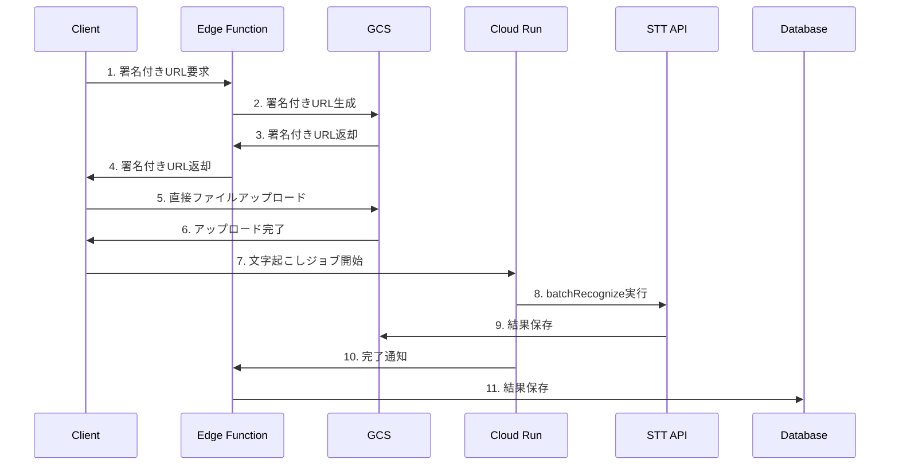

# 音声文字起こしアーキテクチャ再設計

## 概要

現在のSupabase Edge Function経由での音声ファイル処理は、メモリ制限とペイロードサイズ制限により問題が発生している。Google Cloud Storage（GCS）を活用した非同期処理アーキテクチャに変更し、スケーラブルで信頼性の高い音声文字起こしシステムを構築する。

## 現在の問題点

1. **メモリ制限**: Edge Functionでのファイル処理でメモリオーバー
2. **ペイロード制限**: 10MB制限によりコールバック失敗
3. **同期処理**: 長時間の音声ファイルでタイムアウト
4. **非効率なデータ転送**: Edge Functionを経由した不要なデータ転送

## 新しいアーキテクチャ

### 1. ファイルアップロードフロー

### 2. 技術要件

#### 2.1 ファイルアップロード
- **署名付きURL**: GCSのresumable upload URLを使用
- **直接アップロード**: Edge Functionを経由せずクライアントからGCSへ
- **認証**: サービスアカウントによる署名付きURL生成

#### 2.2 文字起こし処理
- **非同期処理**: Google Speech-to-Text v2 batchRecognize API
- **入力**: GCSファイルURI（gs://形式）
- **出力**: GCS結果ファイルURI
- **処理**: Cloud Runでの非同期ジョブ実行

#### 2.3 結果管理
- **Webhook**: Cloud RunからSupabase Edge Functionへの完了通知
- **メタデータ**: ジョブID、状態、結果URIをデータベースに保存
- **セキュリティ**: 署名検証または秘密トークンによる保護

### 3. セキュリティ要件

#### 3.1 認証・認可
- **Cloud Run**: 未認証アクセス禁止
- **IDトークン**: Supabase Edge FunctionからCloud Runへの認証
- **GCS**: 署名付きURLまたはサービスアカウント経由のみ

#### 3.2 データ保護
- **GCSバケット**: 公開アクセス禁止
- **署名付きURL**: 有効期限設定
- **Webhook**: 署名検証による偽リクエスト防止

### 4. ファイル形式要件

#### 4.1 推奨形式
- **FLAC**: 高品質、処理効率良好
- **LINEAR16**: 無圧縮、高品質

#### 4.2 対応形式
- **m4a/MP3**: Cloud Run内で変換処理
- **変換**: STT用にFLAC/LINEAR16に変換

### 5. 実装手順

#### Phase 1: 基盤構築
1. GCSバケット作成と権限設定
2. サービスアカウント設定
3. Cloud Runサービス更新

#### Phase 2: アップロード機能 ✅ 完了
1. ✅ 署名付きURL生成Edge Function
2. ✅ クライアント側アップロード処理
3. ✅ アップロード完了検知
4. ✅ ジョブ管理テーブル設計
5. ✅ フロントエンド統合

#### Phase 3: 文字起こし処理 ✅ 完了
1. ✅ batchRecognize API実装
2. ✅ 非同期ジョブ管理
3. ✅ 結果保存処理
4. ✅ GCS結果取得機能
5. ✅ フロントエンド統合

#### Phase 4: Webhook連携 ✅ 完了
1. ✅ 完了通知Webhook
2. ✅ データベース更新
3. ✅ エラーハンドリング
4. ✅ transcription_jobsテーブル対応
5. ✅ 後方互換性維持

### 6. 注意点

#### 6.1 メモリ管理
- Edge Functionではファイル本体を保持しない
- Base64化やバイナリ読み込みは禁止
- URL発行のみに限定

#### 6.2 アップロード方式
- resumable/multipart方式を使用
- 大容量ファイル対応
- 中断・再開機能

#### 6.3 認証設定
- IDトークンのaudience設定必須
- Cloud Run URLをaudienceに指定
- 権限設定の確認

#### 6.4 非同期処理
- recognize（同期版）は使用禁止
- batchRecognize（非同期版）必須
- タイムアウト対策

#### 6.5 セキュリティ
- GCSオブジェクトの権限管理
- allUsersアクセス禁止
- 署名付きURLまたは権限付きSAのみ

#### 6.6 結果管理
- 長時間音声の結果サイズ管理
- 分割保存や圧縮検討
- Webhook署名検証

### 7. 期待される効果

#### 7.1 パフォーマンス
- メモリ使用量削減
- 処理速度向上
- スケーラビリティ向上

#### 7.2 信頼性
- タイムアウト回避
- エラー耐性向上
- 再試行機能

#### 7.3 保守性
- 責任分離
- デバッグ容易性
- 監視・ログ改善

## 次のステップ

1. **技術検証**: GCS署名付きURL生成の動作確認
2. **プロトタイプ**: 最小限の機能での実装
3. **段階的移行**: 既存機能との並行運用
4. **本格運用**: 完全移行と最適化
