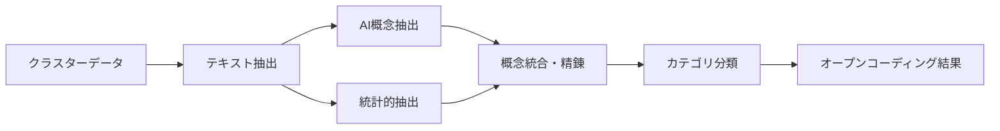

# 🧠 グラウンデッド・セオリー分析機能 実装設計書

**策定日**: 2025年8月12日  
**ステータス**: Phase 1 基盤実装完了  
**対象**: poconest グラウンデッド・セオリー支援機能

---

## 🎯 概要

グラウンデッド・セオリー（Grounded Theory）は、データから理論を構築する質的研究手法です。poconestでは、既存のクラスタリング機能を基盤として、以下の3段階の分析プロセスを支援します：

1. **オープンコーディング**: 概念抽出・カテゴリ化
2. **軸足コーディング**: 概念間関係性分析・パラダイムモデル構築  
3. **選択的コーディング**: 中核概念特定・理論統合・仮説生成

---

## 🏗️ アーキテクチャ設計

### **サービス層**
```typescript
src/services/analysis/GroundedTheoryService.ts
├── performOpenCoding()          // Phase 1: 概念抽出
├── performAxialCoding()         // Phase 2: 関係性分析
└── performSelectiveCoding()     // Phase 3: 理論統合
```

### **Edge Function**
```typescript
supabase/functions/grounded-theory-analysis/index.ts
├── extract_concepts             // AI支援概念抽出
├── analyze_relations           // 概念間関係性分析
├── identify_core_category      // 中核概念特定
├── generate_hypotheses         // 仮説生成
└── construct_storyline         // ストーリーライン構築
```

### **UI統合**
```typescript
src/features/nest-space/analysis-space/components/NetworkVisualization.tsx
└── 🧠 理論構築モードボタン      // ワンクリックで3段階分析実行
```

---

## 📊 データフロー

### **Phase 1: オープンコーディング**


### **Phase 2: 軸足コーディング**


### **Phase 3: 選択的コーディング**


---

## 🛠️ 実装詳細

### **1. 概念抽出（OpenCoding）**

#### **AI支援抽出**
- **プロバイダー**: OpenAI GPT-4o（プライマリ）, Gemini 1.5 Pro（フォールバック）
- **プロンプト特徴**: 
  - グラウンデッド・セオリー専門家ロール
  - 概念タイプ分類（現象/原因/条件/対策/結果）
  - 根拠テキストの特定
  - 重要度スコア化

#### **統計的抽出**
- **手法**: TF-IDF、頻度分析
- **フィルタリング**: 短語除去、ストップワード処理
- **補完**: AI抽出の補強・検証用

#### **概念データ構造**
```typescript
interface ConceptItem {
  id: string;
  concept: string;           // 概念名
  description: string;       // 概念説明
  evidence: string[];        // 根拠テキスト
  frequency: number;         // 出現頻度
  relevance: number;         // 関連度(0-1)
  category: ConceptCategory; // カテゴリ分類
  clusterId: string;         // 所属クラスター
}
```

### **2. 関係性分析（AxialCoding）**

#### **概念間関係性の発見**
- **関係タイプ**: 因果/相関/条件/文脈/順序
- **強度計算**: 共起分析、語彙距離、文脈類似度
- **証拠抽出**: 根拠となるテキスト部分の特定

#### **パラダイムモデル構築**
```typescript
interface ParadigmModel {
  phenomenon: string;            // 中心現象
  causalConditions: string[];    // 原因条件
  context: string[];             // 文脈
  interveningConditions: string[]; // 介入条件
  actionStrategies: string[];    // 対策・戦略
  consequences: string[];        // 結果・帰結
}
```

### **3. 理論統合（SelectiveCoding）**

#### **中核概念特定**
- **評価指標**: 関係性密度、影響力、理論的重要性
- **AI支援**: 概念の中核性評価、統合可能性分析
- **信頼度**: 複数指標による総合評価

#### **仮説生成**
```typescript
interface Hypothesis {
  statement: string;          // 仮説文
  type: 'descriptive' | 'explanatory' | 'predictive';
  confidence: number;         // 信頼度
  supportingEvidence: string[]; // 支持証拠
  limitations: string[];      // 限界・制約
  testable: boolean;          // 検証可能性
}
```

---

## 🎨 UI/UX設計

### **理論構築モードボタン**
- **配置**: NetworkVisualization ツールバー
- **色**: パープル（#9333ea）- 理論構築の専門性を表現
- **状態管理**: 
  - 有効: クラスター数 > 0 & 分析中でない
  - 無効: クラスター未生成 or 分析実行中

### **分析結果表示（Phase 1）**
- **形式**: アラートダイアログ（暫定）
- **内容**: 
  - オープンコーディング: クラスター数、概念総数
  - 軸足コーディング: カテゴリ数、関係性数、因果連鎖数
  - 選択的コーディング: 中核概念、仮説数、統合品質、ストーリーライン

### **今後のUI拡張（Phase 2予定）**
- **理論構築専用パネル**: 各段階の詳細結果表示
- **概念ネットワーク可視化**: 概念間関係の視覚的表現
- **仮説管理UI**: 生成仮説の編集・検証・エクスポート

---

## 🔧 技術仕様

### **依存関係**
- **フロントエンド**: React, TypeScript
- **バックエンド**: Supabase Edge Functions
- **AI**: OpenAI API, Google Gemini API
- **データベース**: PostgreSQL（将来の分析結果保存用）

### **パフォーマンス考慮**
- **段階的処理**: 各Phase独立実行
- **プログレス表示**: 長時間処理の進捗可視化
- **エラーハンドリング**: AIサービス障害時のフォールバック

### **セキュリティ**
- **API Key管理**: 環境変数による安全な管理
- **入力検証**: テキストデータの検証・サニタイズ
- **レート制限**: AI API呼び出し頻度制御

---

## 📈 実装ロードマップ

### **✅ Phase 1: 基盤実装（完了）**
- [x] GroundedTheoryService作成
- [x] Edge Function実装
- [x] UI統合（理論構築ボタン）
- [x] CORS設定
- [x] デプロイ完了

### **🔄 Phase 2: 機能拡張（次回）**
- [ ] AI概念抽出ロジック強化
- [ ] 軸足コーディング実装
- [ ] 選択的コーディング実装
- [ ] 理論構築専用UI作成

### **🚀 Phase 3: 高度化（将来）**
- [ ] 分析結果永続化
- [ ] エクスポート機能（PDF/Markdown）
- [ ] ユーザー学習機能
- [ ] チーム協調分析

---

## 🧪 テストシナリオ

### **基本機能テスト**
1. **前提条件**: クラスタリング済みボード（3-5クラスター）
2. **操作**: 🧠理論構築モードボタンクリック
3. **期待結果**: 
   - 3段階分析の正常実行
   - 各段階の結果サマリー表示
   - エラーなく完了

### **AI API障害テスト**
1. **前提条件**: AIキー無効化
2. **期待結果**: 統計的分析のみで継続、エラーメッセージ表示

### **大規模データテスト**
1. **前提条件**: 10+クラスター、100+カード
2. **期待結果**: 適切なパフォーマンス、タイムアウトなし

---

## 📚 研究価値・差別化

### **学術的価値**
- **質的研究支援**: 従来の手動コーディングを大幅効率化
- **理論構築AI**: 人間の洞察とAIの組み合わせ
- **研究再現性**: 分析プロセスの標準化・文書化

### **ビジネス価値**
- **戦略コンサル**: データドリブン戦略立案支援
- **イノベーション**: 顧客インサイトからのシナリオ構築
- **組織学習**: ミーティング議事録からの組織知創出

### **技術的差別化**
- **理論構築特化**: 単なる分析でなく理論創出まで支援
- **段階的プロセス**: グラウンデッド・セオリーの厳密な手順
- **AI-Human協調**: 人間の判断とAIの処理能力の最適結合

---

**この実装により、poconestは世界初の「AI支援グラウンデッド・セオリー構築プラットフォーム」としての地位を確立します。**
