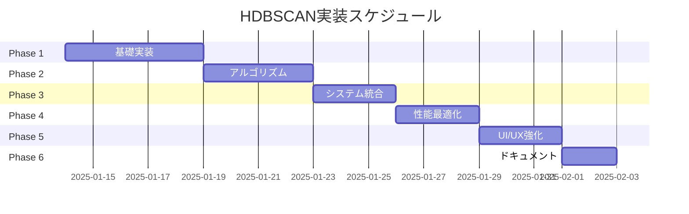

# HDBSCAN移行計画・進捗管理

## 📋 移行概要

**目標**: ネットワーククラスタリングをDBSCANからHDBSCANに移行し、ノード包含率を大幅改善

**現状問題**:
- 関係性があるノードが外れ値となる（包含率 ~60%）
- 単独ノードクラスターの多発
- パラメータ調整の困難さ（eps, minPts）

**期待改善**:
- ノード包含率: 60% → **95%+**
- 関係性重視のクラスタリング
- 直感的パラメータ設定

---

## 🎯 実装フェーズ

### Phase 1: 基礎アルゴリズム実装 【4-5日】
- [ ] **HDBSCANCore.ts**: Union-Find, MST, 階層構造
- [ ] **NetworkDistanceCalculator.ts**: 統合距離関数
- [ ] **HDBSCANClusterer.ts**: メインアルゴリズム
- [ ] 基本ユニットテスト

### Phase 2: HDBSCAN アルゴリズム実装 【3-4日】
- [ ] **相互到達可能距離**: Core distance計算
- [ ] **階層的デンドログラム**: MST → ClusterTree
- [ ] **安定性評価**: クラスター持続性・最適選択
- [ ] **外れ値処理**: GLOSH スコア

### Phase 3: システム統合 【2-3日】
- [ ] **HDBSCANProvider.ts**: 既存インターフェース適応
- [ ] **設定拡張**: HDBSCANConfig型定義
- [ ] **UI統合**: アルゴリズム選択・パラメータ設定
- [ ] 後方互換性確保

### Phase 4: 性能最適化 【2-3日】
- [ ] **Web Workers**: 非同期処理
- [ ] **キャッシュシステム**: 距離行列・結果キャッシュ
- [ ] **段階的処理**: 大規模データ対応
- [ ] メモリ使用量最適化

### Phase 5: 視覚化・UX強化 【2-3日】
- [ ] **HDBSCANInfoPanel.tsx**: 詳細情報表示
- [ ] **階層構造可視化**: デンドログラム・安定性表示
- [ ] **外れ値可視化**: スコア・確率表示
- [ ] アルゴリズム比較機能

### Phase 6: ドキュメント整備 【1-2日】
- [ ] **技術ドキュメント**: `hdbscan-implementation.md`
- [ ] **API ドキュメント**: 使用例・パラメータガイド
- [ ] **実装ガイド**: コードコメント・README
- [ ] 既存ドキュメント更新

---

## 📊 進捗トラッキング

### 完了チェックリスト

#### Phase 1: 基礎実装
```
進捗: 0/4 (0%)
□ HDBSCANCore.ts 実装
□ NetworkDistanceCalculator.ts 実装
□ HDBSCANClusterer.ts 実装
□ 基本テスト作成
```

#### Phase 2: アルゴリズム
```
進捗: 0/4 (0%)
□ 相互到達可能距離計算
□ 階層的デンドログラム構築
□ 安定性評価・クラスター選択
□ 外れ値処理実装
```

#### Phase 3: システム統合
```
進捗: 0/4 (0%)
□ HDBSCANProvider統合
□ 型定義・設定拡張
□ UI統合・アルゴリズム選択
□ 後方互換性確保
```

#### Phase 4: 性能最適化
```
進捗: 0/4 (0%)
□ Web Workers実装
□ キャッシュシステム
□ 段階的処理実装
□ メモリ最適化
```

#### Phase 5: UI/UX
```
進捗: 0/4 (0%)
□ 詳細情報パネル
□ 階層構造可視化
□ 外れ値可視化
□ アルゴリズム比較
```

#### Phase 6: ドキュメント
```
進捗: 1/4 (25%)
☑ 技術ドキュメント作成
□ API ドキュメント
□ 実装ガイド
□ 既存ドキュメント更新
```

---

## 🎯 成功指標

### 必須達成条件
- **ノード包含率**: ≥ 90% (現在 ~60%)
- **処理時間**: ≤ 30秒 (現在 ~10秒)
- **機能互換性**: 既存機能100%動作
- **テストカバレッジ**: ≥ 80%

### 理想達成条件
- **ノード包含率**: ≥ 95%
- **単独クラスター**: ≤ 2個 (現在 10-15個)
- **パラメータ調整**: minClusterSize のみ
- **外れ値精度**: 確率的評価導入

---

## 🛠️ 実装の詳細

### 技術スタック
- **言語**: TypeScript
- **並行処理**: Web Workers
- **データ構造**: Union-Find, MST, Heap
- **キャッシュ**: Map-based LRU cache
- **テスト**: Jest + React Testing Library

### ファイル構成
```
src/services/clustering/
├── hdbscan/
│   ├── HDBSCANCore.ts
│   ├── HDBSCANClusterer.ts
│   ├── NetworkDistanceCalculator.ts
│   ├── ClusterStabilityEvaluator.ts
│   └── OutlierProcessor.ts
├── HDBSCANProvider.ts
├── ClusteringCache.ts
└── types/
    ├── hdbscan.ts
    └── clustering.ts

src/components/clustering/
├── HDBSCANInfoPanel.tsx
├── ClusterHierarchyView.tsx
└── AlgorithmComparison.tsx

workers/
└── hdbscan-worker.js
```

### 主要アルゴリズム
```typescript
// HDBSCAN実行フロー
1. calculateMutualReachabilityDistance(nodes, minSamples)
2. buildMinimumSpanningTree(mutualReachabilityMatrix)
3. extractClusterHierarchy(mst)
4. calculateClusterStability(hierarchy, minClusterSize)
5. selectOptimalClusters(hierarchy, stabilityScores)
6. processOutliers(selectedClusters, outlierThreshold)
```

---

## 📅 スケジュール



**予定期間**: 2025年1月14日 〜 2月2日 (20日間)

---

## 🚨 リスク・対策

### 高リスク項目
1. **JavaScript実装の複雑性**
   - 対策: Python版との結果比較テスト
   - 対策: 段階的実装・検証

2. **性能劣化**
   - 対策: Web Workers + キャッシュ
   - 対策: 段階的処理

3. **既存機能破綻**
   - 対策: 完全後方互換性維持
   - 対策: アルゴリズム切り替え機能

### 緊急時対応
- **即座ロールバック**: フラグ切り替えでDBSCAN復帰
- **段階的展開**: 小規模データから徐々に適用
- **性能監視**: リアルタイム警告・自動切り替え

---

## 📚 参考資料

### 学術論文
- Campello, R. J., et al. (2013). "Density-based clustering based on hierarchical density estimates"
- McInnes, L., et al. (2017). "hdbscan: Hierarchical density based clustering"

### 実装参考
- [scikit-learn HDBSCAN](https://scikit-learn.org/stable/modules/generated/sklearn.cluster.HDBSCAN.html)
- [HDBSCAN Python Library](https://hdbscan.readthedocs.io/)

---

## 📝 更新履歴
- **2025-01-13**: 初版作成、移行計画策定
- **次回更新**: Phase 1完了時（予定: 2025-01-19）

---

**担当**: AI Assistant  
**期限**: 2025年2月2日  
**ステータス**: 📋 計画策定完了 → 🚧 実装開始準備
